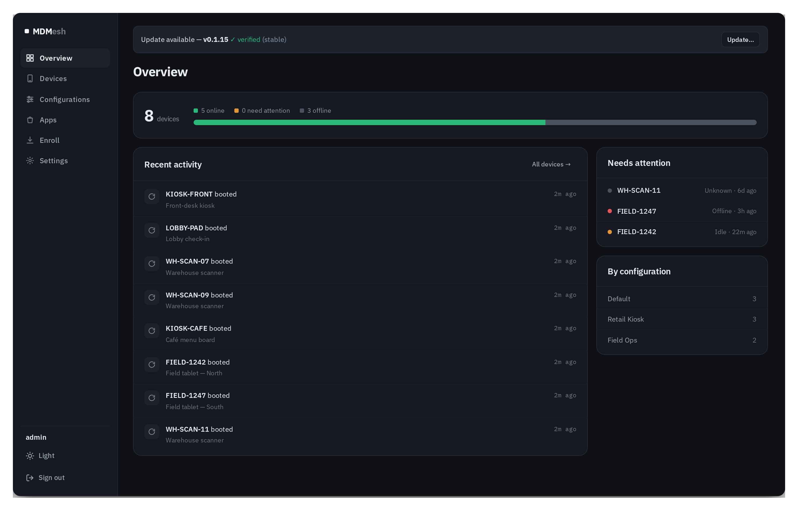
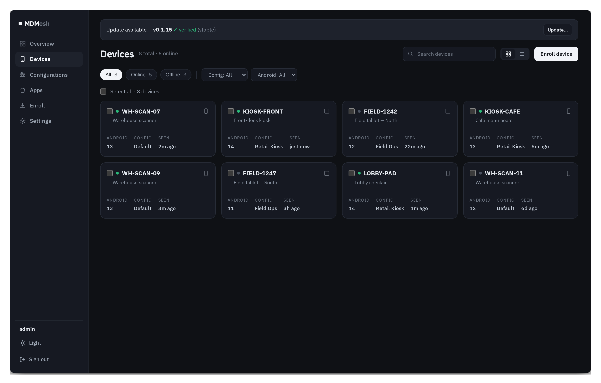
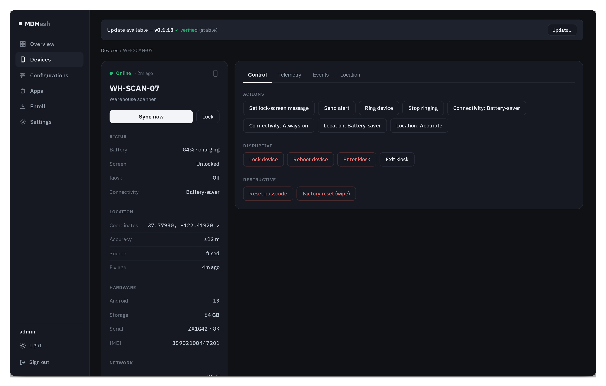
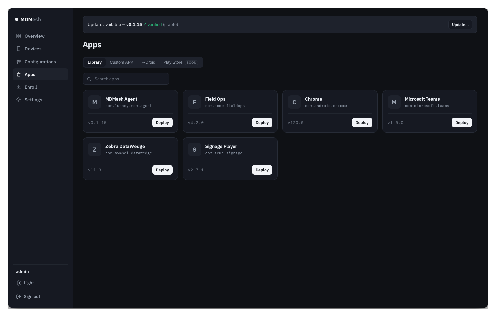
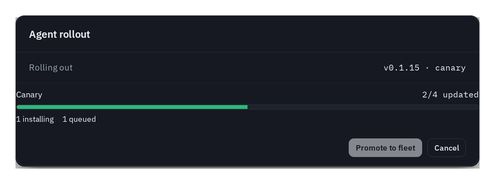

<div align="center">

# ◧ MDMesh

**A modern, self-hosted Android MDM** — fleet control, kiosk, app delivery, and
signed auto-updates, with a console that doesn't feel like 2012.

[](LICENSE)
[](CONTRIBUTING.md)


[Quick start](#-quick-start) · [Features](#-features) · [Full setup](DEPLOY.md) · [Architecture](STRUCTURE.md) · [Contributing](CONTRIBUTING.md) · [Roadmap](#-roadmap)

<br/>



<sub><i>The MDMesh console — overview (shown with sample data).</i></sub>

</div>

---

## What is MDMesh?

MDMesh is an open-source **Mobile Device Management** platform for Android: enroll devices as
Device Owner via a QR code, then manage them from a clean web console — push apps, lock devices into
kiosk mode, track location, run remote actions, and keep the whole fleet (server **and** agent) updated
with **signed, auto-rolling-back** releases.

It began as a fork of [Headwind MDM](https://h-mdm.com) and is being rebuilt into a distinct product
across four planes:

| Plane | What it is | Stack |
|------|------------|-------|
| **Control plane** | The MDM server / REST API | Java · Jersey · Guice · MyBatis · PostgreSQL |
| **Admin console** | The modern web UI in this README | React · TypeScript · Vite |
| **Device agent** | A from-scratch Device-Owner app | Kotlin · coroutines · WorkManager |
| **Edge + updates** | TLS edge, tunnel, signed updater/recovery | Caddy · Cloudflare Tunnel · minisign |

### Our goal

> A **genuinely complete, robust, and modernized** open-source MDM — not a museum piece with a paywalled
> "enterprise edition." Kiosk, app delivery, location, reliable connectivity, one-command deployment, and
> a real CI/CD auto-update pipeline are all in the **open-source core**. The agent is engineered against a
> versioned, capability-negotiated protocol so the Android version treadmill stays cheap to maintain, and
> old agents keep working across server updates.

---

## ✨ Features

<table>
<tr>
<td width="33%" valign="top">

**🛰 Fleet management**
Groups, configurations, live status, and a fast device list with search + filters.

</td>
<td width="33%" valign="top">

**🔒 Kiosk / COSU**
Single-app or multi-app lock-task with a custom home launcher and a crash-loop guard.

</td>
<td width="33%" valign="top">

**📦 App delivery**
A library + custom-APK upload + F-Droid, silent install/upgrade, and a deploy flow.

</td>
</tr>
<tr>
<td width="33%" valign="top">

**📍 Location**
Passive or active tracking, history trail, and a Leaflet map on the device page.

</td>
<td width="33%" valign="top">

**🔌 Reliable connectivity**
Instant wake channel when charging, battery-aware otherwise; survives reboots + self-updates.

</td>
<td width="33%" valign="top">

**♻️ Signed auto-update**
One-click or unattended server updates with DB backup + auto-rollback, plus a recovery page.

</td>
</tr>
</table>

<details>
<summary><b>Full feature list</b></summary>

- **Enrollment** — QR-code Device-Owner provisioning (factory-reset → scan); one signed APK serves every
  deployment (server URL delivered in the QR, not baked in).
- **Modern console** — dashboard, fleet views, device detail, app catalog, enrollment, settings; dark/light
  themes; keyboard-friendly and responsive.
- **Remote actions** — lock-screen message, alert, ring, lock, reboot, passcode reset, factory wipe,
  connectivity power mode, location mode — all capability-gated so old agents never get a command they
  can't run.
- **Kiosk** — COSU lock-task, home-screen replacement, allowed-apps, themed app grid, crash-loop protection.
- **App management** — upload/parse APKs, F-Droid catalog, silent Device-Owner install/upgrade, version &
  downgrade gating.
- **Telemetry** — battery, storage, network, Android version, Device-Owner status, lifecycle event timeline.
- **Deployment** — one `./setup.sh`: Docker Compose with bundled auto-HTTPS (Caddy) for your own domain, or
  a permanent Cloudflare Tunnel; a native (non-Docker) installer; generated secrets.
- **CI/CD auto-update** — tag a release → CI builds & **signs** artifacts (Ed25519/minisign) + a manifest →
  every deployment notices, **verifies**, and (on approval, or unattended) updates server/web with a
  database backup and **automatic rollback** on failure; a decoupled recovery service stays up if an
  update breaks the main server.
- **Staged device rollout** — push the newest **compatible** agent APK to a hand-picked **canary** set,
  watch it land, then **promote to the fleet** — mirrored from your own origin, integrity-checked.
- **Backward compatibility** — versioned `/agent/v1` contract (additive-only, golden contract test in CI),
  so a newer server keeps serving older agents.

</details>

---

## 📸 The console

<div align="center">

<br/>
<sub><i>Devices — fleet at a glance with status, configuration, and an update banner.</i></sub>

<br/><br/>

<br/>
<sub><i>Device detail — live status, location, hardware, and the remote-action console.</i></sub>

<br/><br/>

<br/>
<sub><i>Apps — library, custom APKs, and F-Droid, with one-click deploy.</i></sub>

<br/><br/>

<br/>
<sub><i>Staged canary → fleet agent-APK rollout, with live progress.</i></sub>

</div>

> Screenshots show the real console rendered with representative sample data. Regenerate them with
> `cd scripts/shots && npm i && node capture.mjs`.

---

## 🚀 Quick start

**Requirements:** Docker + Docker Compose v2 and `openssl` (or use the native installer). A Linux host.

```bash
git clone https://github.com/MDMesh-app/MDMesh.git
cd MDMesh
./setup.sh           # interactive: Cloudflare Tunnel, or your own HTTPS domain
```

`setup.sh` generates your secrets, brings up the stack, and prints the console URL + a generated admin
password. Then:

1. Open the console, go to **Enroll**, and generate a QR code.
2. **Factory-reset** an Android device and tap the welcome screen 6× to open the QR scanner (or use
   `adb shell dpm set-device-owner` for a dev device).
3. Scan the QR — the device enrolls as Device Owner and checks in.

No Docker? Run `./setup.sh --native`. Full details, hosting modes, updates, and recovery are in the
**[full setup guide → DEPLOY.md](DEPLOY.md)**.

---

## 🧭 Where to go next

| I want to… | Read |
|------------|------|
| Deploy it properly (domains, tunnels, updates, recovery) | **[DEPLOY.md](DEPLOY.md)** |
| Understand the codebase layout (the four planes) | **[STRUCTURE.md](STRUCTURE.md)** + [docs/adr](docs/adr) |
| Contribute code, file a bug, or request a feature | **[CONTRIBUTING.md](CONTRIBUTING.md)** |
| Cut and sign a release | **[RELEASING.md](RELEASING.md)** |
| Understand the agent internals | [docs/agent-architecture.md](docs/agent-architecture.md) |

---

## 🗺 Roadmap

- ✅ Modern React + TypeScript console
- ✅ From-scratch Kotlin Device-Owner agent (versioned, capability-negotiated protocol)
- ✅ Kiosk / COSU + custom launcher
- ✅ App catalog + silent deploy
- ✅ Location tracking + history + map
- ✅ Reliable always-on connectivity (wake channel, reboot/self-update resume)
- ✅ One-command deployment (Docker + Caddy auto-HTTPS + Cloudflare Tunnel + native installer)
- ✅ CI/CD: signed releases, one-click/unattended server update + auto-rollback + recovery page
- ✅ Staged canary → fleet agent-APK rollout
- 🔜 **Live remote control** (screen view + input, WebRTC + self-hosted TURN)
- 🔭 OEM-privileged tier (Knox / Zebra adapters) — parked behind the capability layer

---

## 🤝 Contributing

Contributions are welcome — code, docs, bug reports, and ideas. Start with **[CONTRIBUTING.md](CONTRIBUTING.md)**
for the dev setup (server, agent, console), build/test commands, and conventions.

- **🐞 Found a bug?** Open a [bug report](https://github.com/MDMesh-app/MDMesh/issues/new?template=bug_report.yml).
- **💡 Have an idea?** Open a [feature request](https://github.com/MDMesh-app/MDMesh/issues/new?template=feature_request.yml).
- **🔧 Sending a PR?** The [PR template](.github/pull_request_template.md) has the checklist — small, focused PRs with tests + docs are easiest to merge.

> One hard rule for the agent ↔ server contract: the `/agent/v1` API is **additive-only** so older agents
> keep working. See [ADR-0009](docs/adr/0009-agent-v1-contract-stability.md).

---

## 📜 License & credits

MDMesh is licensed under the **[Apache License 2.0](LICENSE)**.

It is a fork of and builds on **[Headwind MDM](https://h-mdm.com)** by Headwind Solutions LLC, also
Apache-2.0. The licensing and rebrand rationale is recorded in
[ADR-0008](docs/adr/0008-licensing-and-rebrand.md). Trademarks and brand names belong to their owners.
