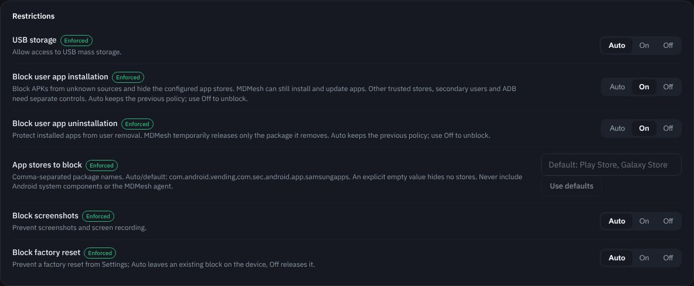

# User app installation and removal restrictions

These opt-in policies restrict user app management on Android 8+ Device Owner
devices while preserving MDMesh remote APK installation, updates and removal.
Update the server, console and agent together; console controls alone cannot
apply Android restrictions.

## Configuration

Under Configurations → Restrictions:

| Field | On | Off | Auto |
| --- | --- | --- | --- |
| Block user app installation | Restrict unknown sources and hide configured stores | Undo changes owned by this policy | Preserve the previous device policy |
| Block user app uninstallation | Protect installed packages from user removal | Remove protections owned by this policy | Preserve the previous device policy |

**Auto does not unblock.** Select Off and verify the device state before retiring
the policy. New configurations leave both fields unmanaged by default.

App stores to block accepts comma-separated package names. The default is
`com.android.vending,com.sec.android.app.samsungapps` (Play Store and Galaxy
Store). Use defaults restores that default. An explicitly empty string hides
no stores, but the unknown-source restriction still applies. Absent stores are
ignored. Add any other trusted stores present in the fleet; the agent does not
identify every possible store automatically.

The agent rejects known management/system components and registered APK handlers
in the store list. Keep Android's package installer available for managed installs.

## Managed operations and recovery

The implementation does not set `DISALLOW_INSTALL_APPS` or
`DISALLOW_UNINSTALL_APPS`. It uses the unknown-source user restriction,
`setApplicationHidden` for configured stores and `setUninstallBlocked` per package.

MDMesh installation and updates remain available with the policy active. Newly
installed packages are protected after a managed install; package events also
schedule offline reconciliation. For managed removal, only the target package's
policy-owned protection is released. Other packages remain protected. Removal
failure, cancellation or the five-minute operation timeout restores protection
if the package still exists. During the temporary release, user removal of that
specific target is also possible.

A synchronous persistent journal records owned changes before Android mutations,
including interrupted removals. Startup, boot and package events schedule recovery.
A mutex coordinates policy application, reconciliation and managed operations.
Restoration failures retain the journal for a subsequent recovery attempt.
Stores hidden and packages protected before this policy are not claimed as owned
changes and are not unblocked when the policy is disabled.

## Contract and compatibility

The migration appends three nullable columns: `blockUserAppInstall`,
`blockUserAppUninstall` and `blockedAppStores`. Existing rows remain unmanaged.
Configuration copy, insert/update, serialization and revision hashing include
the new fields.

Protocol 1.3 is additive. `policies.userAppInstall` and
`policies.userAppUninstall` retain the existing `true = allowed` convention.
`blockedAppStores` is optional: absence preserves the previously managed list,
initially Play/Galaxy Store; an empty array means no stores to hide.
Capabilities are advertised only on Android 8+ Device Owner devices.

Older agents ignore the optional store field and report unsupported policy keys.
The device's configuration verdict shows Partially supported when matching-revision
outcomes include unsupported fields. Server fleet counters retain their existing
revision-based meaning; a matching revision is not proof that every restriction
was enforced.

The policy controls the Android user in which the agent runs. Additional users,
root access, enabled ADB and stores omitted from the configured list require
separate controls. No claim is made that all Samsung models behave identically.
Existing platform/OEM restrictions may independently prevent an operation.

## Verification

The adapted branch builds on upstream main. Verification on 2026-10-06:

- JDK17 Maven server reactor: 86 tests passed and WAR packaged.
- Android proto/policy/core: 112 JVM tests passed; detekt and debug APK build passed.
- Console: production build and six configuration-verdict tests passed.
- Chromium fixtures: On/Off/Auto, default store reset and saved configuration
  payload passed without browser errors. Screenshot below uses sample data.
- Migration/mapper XML and schema JSON parse correctly. The database migration
  has not been exercised against a live PostgreSQL instance in this environment.

Previous modified-agent build19 hardware testing by the contributor:

| Samsung model | Android | QR enrollment | Restrictions |
| --- | --- | --- | --- |
| SM-P585M | 8.1.0 | Successful | Reported working |
| SM-A035M | 13 | Successful | Reported working |
| SM-X236B | 16 | Local signing fails; official APK succeeds | Working after ADB enrollment |

Remote app installation was confirmed with restrictions active on the Android16
device. These results predate this main-based adaptation and are not exhaustive
acceptance of remote removal, interrupted-operation recovery, reboot persistence,
or agent updates on all three models. The Android16 QR cause remains unresolved.



```bash
mvn -pl server -am package
cd web && npm ci && npm run build && npm test
cd ../agent-android
./gradlew :proto:test :policy:testDebugUnitTest :core:testDebugUnitTest :app:assembleDebug detekt
cd ../scripts/shots && npm install && npx playwright install chromium
node app-restrictions-check.mjs
```

The browser check uses fixtures only. Optional `CHROMIUM_PATH` selects an installed
browser; `SCREENSHOT_PATH` captures the restriction panel. For hardware acceptance,
verify actual blocked user installs/removal, managed install/update/removal,
failed/interrupted removal recovery, reboot, agent update, store-list changes,
pre-existing restrictions, and Off/Auto behavior before fleet rollout.

Use a lab configuration and a correctly signed provisioning QR. Preserve the
agent's package/signing identity for updates and increase versionCode. A debug
build does not replace the official release agent in place. Do not commit private
signing keys or deployment credentials.

## Android references

- [User restrictions](https://developer.android.com/reference/android/os/UserManager)
- [Application hiding](https://developer.android.com/reference/android/app/admin/DevicePolicyManager#setApplicationHidden(android.content.ComponentName,%20java.lang.String,%20boolean))
- [Package uninstall protection](https://developer.android.com/reference/android/app/admin/DevicePolicyManager#setUninstallBlocked(android.content.ComponentName,%20java.lang.String,%20boolean))
